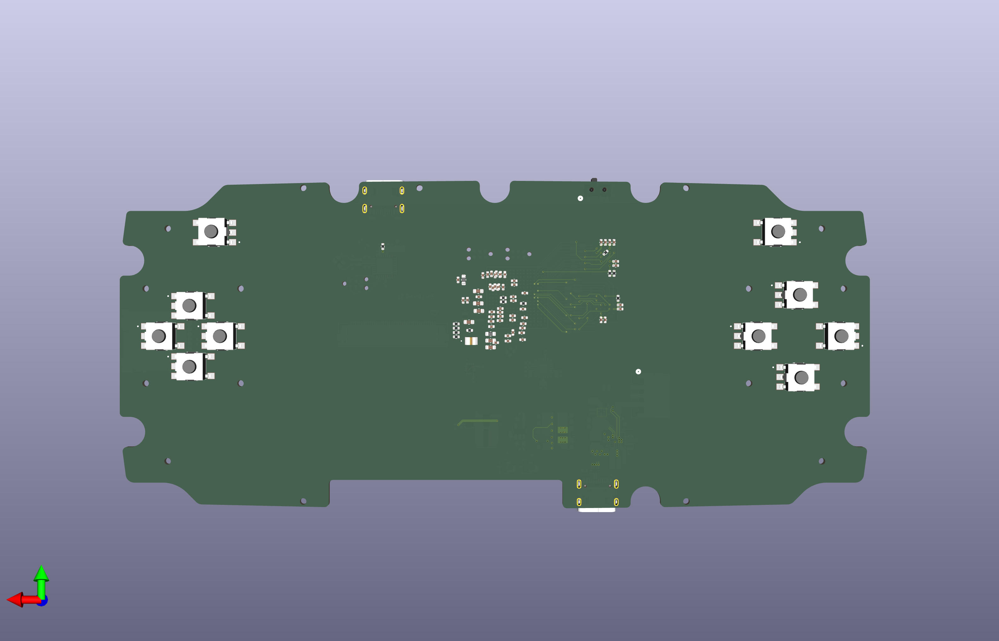
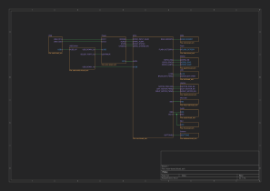
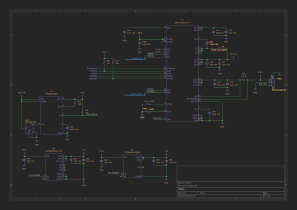
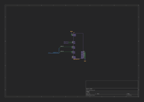

## Game Console Project 1

Hobby handheld game console from scratch.

## Features

- Display: 4.3", 480x272, 16:9, 1200cd/m2, non-touch
- Processor: STM32N657X0
  - Arm Cortex-M55 @ 800 MHz
  - 2D GPU with scaling, rotating, alpha blending, texture mapping
- RAM:
  - 4.2MB on-chip SRAM
  - 32MB off-chip PSRAM
- Storage:
  - 32MB SLC NOR flash
  - Micro SD card slot
- Audio:
  - Stereo DAC with Class-D amplifiers
  - Stereo 1W speakers
- Haptics:
  - Dual vibration motors
- Input:
  - IMU (accelerometer and gyroscope)
  - D-pad
  - A / B / X / Y buttons
  - Start / Select buttons
  - Right and left bumpers
- Battery:
  - 500mAh Li-Po battery
- Connectivity:
  - USB-C for charging and accessing storage
  - Wi-Fi and Bluetooth via STM32-C6
- Mechanicals:
  - 3D printed where possible
- Software:
  - Zephyr RTOS
  - Old game console emulators

## Development Tooling

- Schematics and PCB design: KiCad
- 3D modeling: Fusion 360

## Hardware Block Design

TODO

## Mechanicals

### Top View

## PCB

### Top

### Top Bottom

## Schematics 

### Top Sheet

### Audio

### Buttons

### ESP32

### Flash

### Haptics

### IMU

### LCD

### MCU

### Micro SD

### Power

### RAM

### USB Switch

### USB

